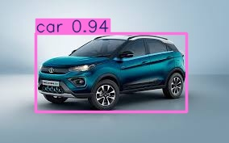
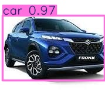
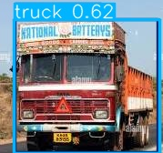
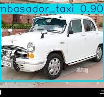
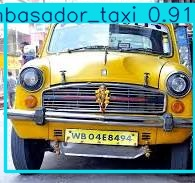

# **🚗 Vehicle Object Detection Using YOLOv8n**

*Precision, speed, and efficiency in detecting vehicles across diverse environments.*

## **🌟 Overview**
Welcome to **Vehicle Object Detection using YOLOv8n!** This project leverages the YOLOv8n model to perform high-accuracy vehicle detection. Utilizing the JUIVCDv1 dataset, this project addresses real-world challenges in vehicle classification, achieving exceptional results with minimal computational overhead.

**"Simplifying vehicle detection, enhancing every journey."**

## **🎯 Features**
- **🚗 Real-Time Vehicle Detection:** Utilizing the state-of-the-art YOLOv8n architecture.
- **🧠 Robust Model:** Achieves 97.4% mAP on the test set, ensuring high precision.
- **🔄 Comprehensive Data Processing:** Addressing dataset inconsistencies for better accuracy.
 
## **🔍 How It Works**
  **Vehicle Object Detection using YOLOv8n** involves several critical steps from data preparation to model evaluation:

### **Key Technologies:**
- **YOLOv8n (Ultralytics)**
- **Google Colab for training**
- **Roboflow for data annotation and pre-processing**
- **Python Libraries:** OpenCV, NumPy, Pandas

### **Workflow:**
1. **Data Preparation:**
    - Initially the [JUIVCDv1 dataset](https://www.kaggle.com/datasets/sourajitmaityju/juivcdv1-indian-vehicle-classification) from downloaded from Kaggle, consisting of images and annotation.
    - It has many data issues like annotation mismatches, image format inconsistencies, and incorrect class mappings.
    - So it is exported to roboflow for reannotation,resolved issues and then exported data in yolo format.
    - The [data](https://github.com/Akashkg03/VEHICLE-OBJECT-DETECTION-USING-YOLOv8n/tree/main/data) folder has preprocessed data imported from roboflow.

3. **Training Configuration:**
    - **Batch Size:** 16
    - **Epochs:** 50
    - **Image Size:** 640x640
    - **Optimizer:** Auto
      
4. **Model Evaluation:**
    - Achieved 97.4% mAP50, 87.6% mAP50-95, 96.6% precision and 96% recall on test data.

## **📊 Performance Metrics**
- **mAP50:** 97.4%
- **mAP50-95:** 87.6%
- **Precision:** 96.6%
- **Recall:** 96%
  
These metrics highlight the model's robustness in detecting and classifying vehicles with high confidence.

## **🛠️ Sample Predictions:**
Example of YOLOv8n accurately detecting vehicles with high confidence.

 &nbsp;&nbsp;&nbsp;&nbsp;&nbsp;&nbsp;&nbsp;&nbsp;&nbsp;&nbsp; 
 &nbsp;&nbsp;&nbsp;&nbsp;&nbsp;&nbsp;&nbsp;&nbsp;&nbsp;&nbsp;  
 &nbsp;&nbsp;&nbsp;&nbsp;&nbsp;&nbsp;&nbsp;&nbsp;&nbsp;&nbsp; 
 &nbsp;&nbsp;&nbsp;&nbsp;&nbsp;&nbsp;&nbsp;&nbsp;&nbsp;&nbsp; 

## **🌍 Connect with Me**
- **[LinkedIn](www.linkedin.com/in/akash-k-g)**
- **[GitHub](https://github.com/Akashkg03)**

